

# Mahamadou Allachi Boukar Allachi
### Full-Stack Software Engineer

Niamey, Niger · M.Sc. Computer Engineering, Üsküdar University

I build web and mobile applications end-to-end — backend architecture,
database design, and frontend UX — with a focus on production-ready,
maintainable systems. I also work in computer vision research; see my
[License Plate Detection & Enhancement](https://github.com/zolkid85/PlateDetectionDemo)
project (Master's thesis).

> **Note on source code:** the projects below are private, production
> codebases built for real clients. This repository showcases the work
> through descriptions and screenshots — code walkthroughs available on
> request.

## Contents

- [PharmaLink Backoffice](#-pharmalink-backoffice--pharmacy-management-web-app)
- [PharmaSwift](#-pharmaswift--pharmacy-delivery-app)
- [ILM — Online Learning Platform](#-ilm--online-learning-platform)

---

## 🏥 PharmaLink Backoffice — Pharmacy Management Web App

A web platform for pharmacists and administrators covering the full
operational workflow of a pharmacy: point of sale, prescriptions,
invoicing, suppliers, inventory, and accounting.

**Stack:** Angular (standalone components, Signals) · Laravel · PostgreSQL/MySQL

**Highlights**
- **Point of Sale (POS)** redesigned from scratch, inspired by modern
  retail POS systems (Square, Shopify POS) — fast checkout, real-time cart
  and stock feedback
- **Tax-compliant invoicing** (Niger CGI) — sequential, non-editable
  invoice numbering (NIF/RCCM), QR code, and per-invoice integrity hash
- **Activity log with chained integrity hashing** — every create/update/
  delete is logged with a before/after diff (audit-trail grade
  traceability)
- App-wide toast and confirmation-dialog systems (replacing native
  browser alerts/confirms)
- Full sales, prescriptions, invoicing, supplier orders, inventory, and
  accounting modules

<table>
<tr>
<td></td>
<td>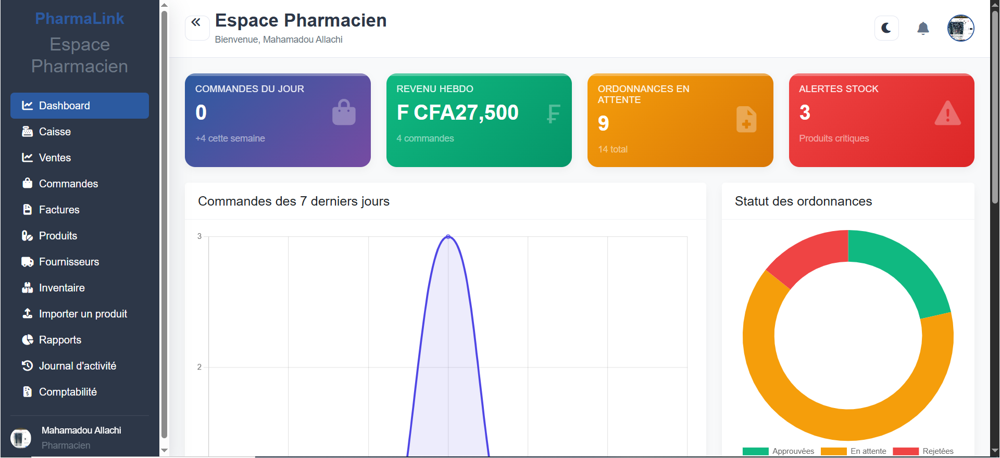</td>
</tr>
<tr>
<td>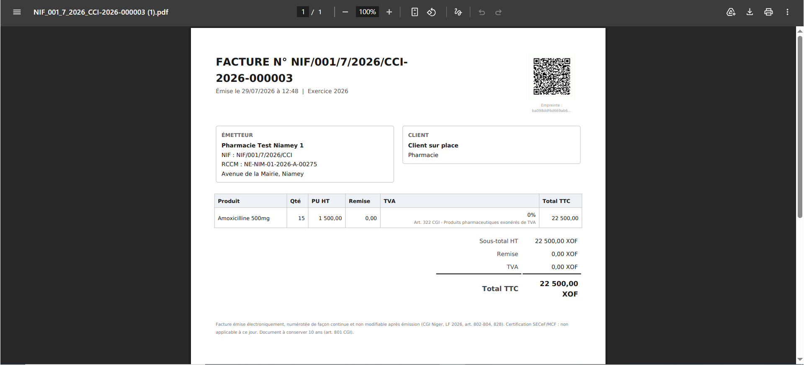</td>
<td>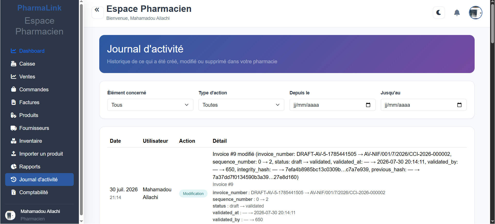</td>
</tr>
</table>

---

## 💊 PharmaSwift — Pharmacy Delivery App

A mobile app connecting customers with local pharmacies for prescription
and product ordering, with real-time delivery tracking.

**Stack:** Flutter · Laravel · MySQL/PostgreSQL · Firebase Cloud Messaging

**Roles:** Client (browse, order, track) · Livreur (manage deliveries)

**Highlights**
- Pharmacy browsing with live product availability and urgency/on-call
  pharmacy lookup ("Urgence Garde")
- Cart, checkout, and delivery-address flow with multiple payment methods
  (cash on delivery, mobile money, card — coming soon)
- Order history with live status tracking (pending, cancelled, delivered)
- Dedicated **Livreur (delivery)** view: map of available orders in
  Niamey, per-order accept/refuse and pickup → destination flow, earnings
  dashboard
- Real-time push notifications (order status, delivery updates)
- Secure payment verification flow

<table>
<tr>
<td></td>
<td>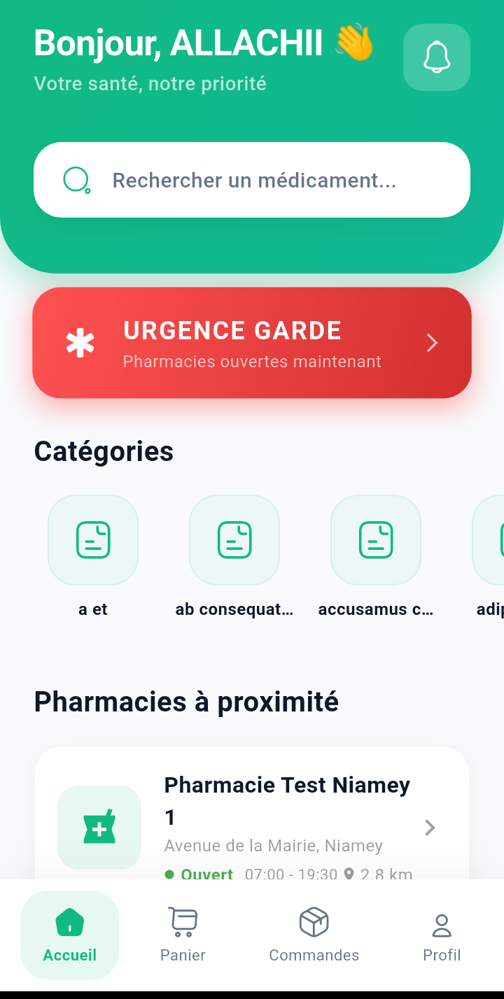</td>
<td>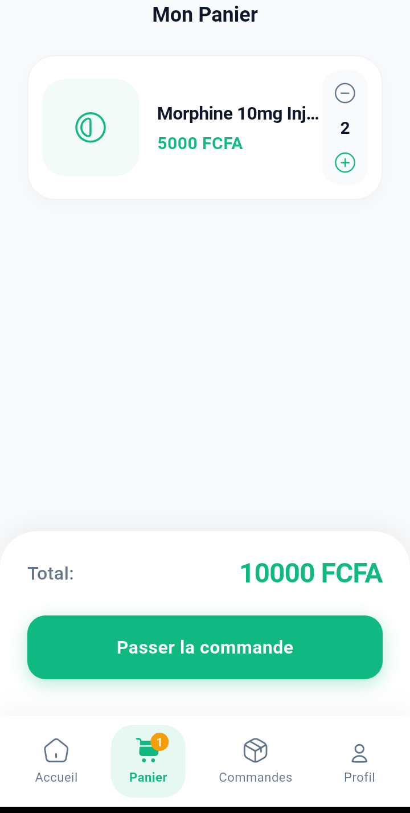</td>
</tr>
<tr>
<td>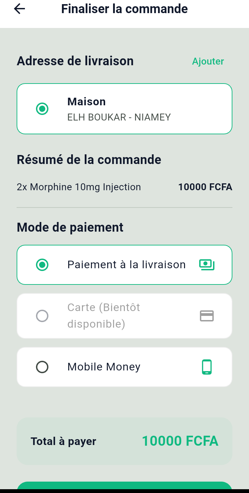</td>
<td>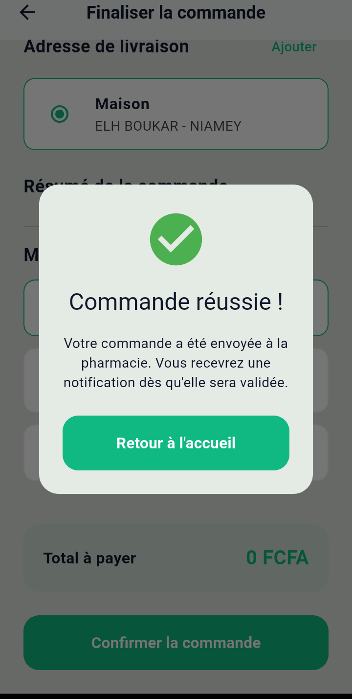</td>
<td>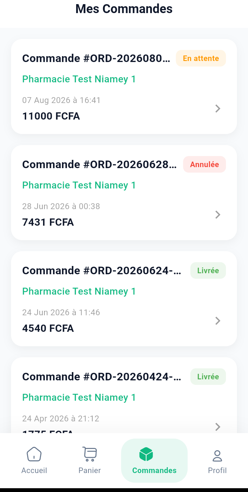</td>
</tr>
<tr>
<td>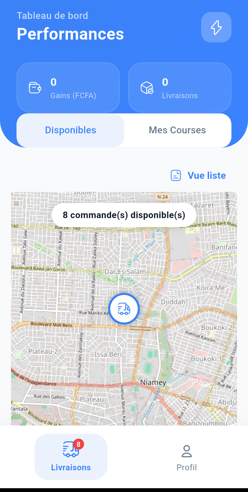</td>
<td>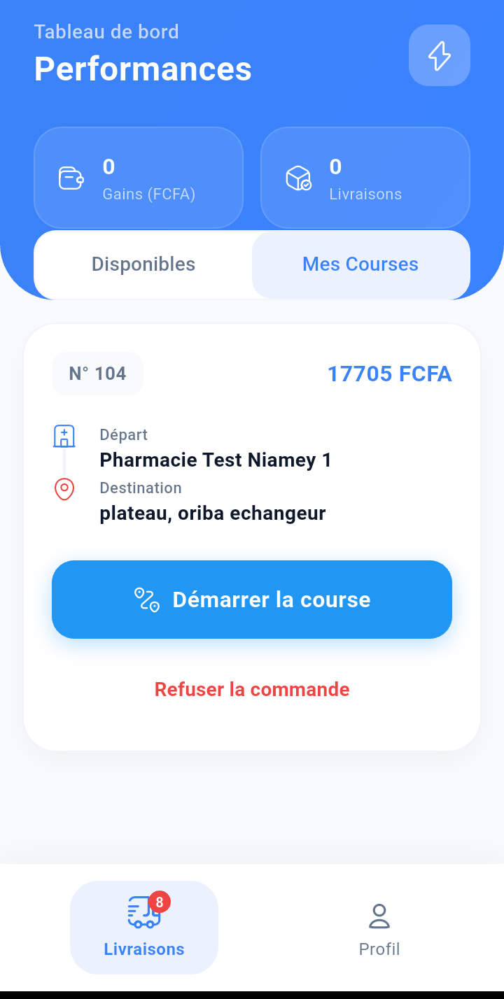</td>
<td></td>
</tr>
</table>

---

## 🎓 ILM — Online Learning Platform

A subscription-based e-learning platform covering the full school
curriculum from **6ème to Terminale** (French secondary system), with
parental follow-up and direct teacher interaction.

**Stack:** Laravel · Angular · PostgreSQL/MySQL

**Highlights**
- Subscription-based course access, automatically scoped to the
  student's grade level
- Course content as **text, video, or PDF**
- End-of-chapter **level quizzes**, with results and time-spent stats
  shareable with parents
- **Messaging space** with subject teachers + an open student **forum**
- Per-course progress tracking
- Dedicated **admin panel**: students, instructors, courses, enrollments,
  subscriptions, and analytics

<table>
<tr>
<td>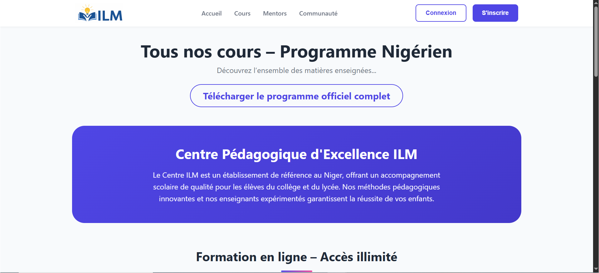</td>
<td>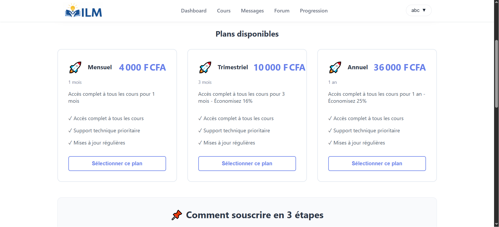</td>
</tr>
<tr>
<td>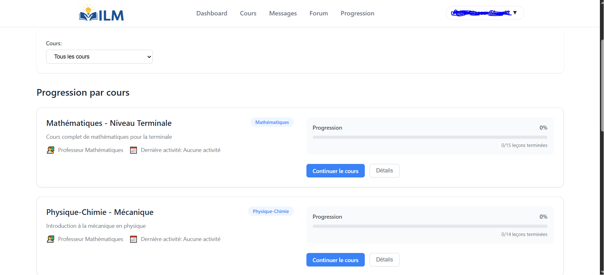</td>
<td>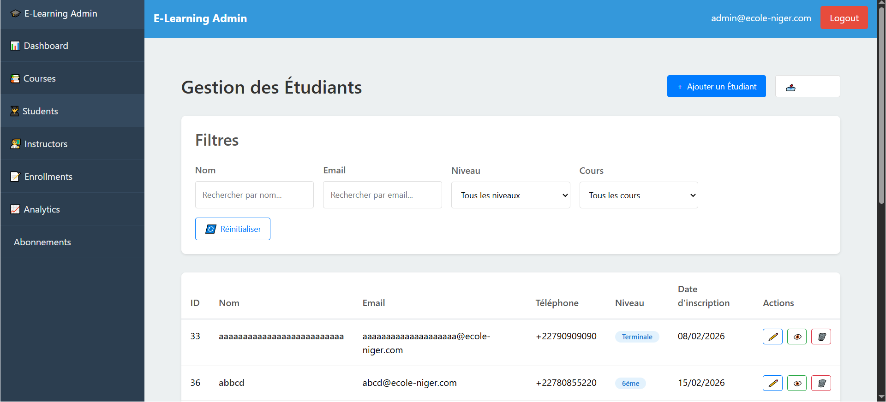</td>
</tr>
</table>
